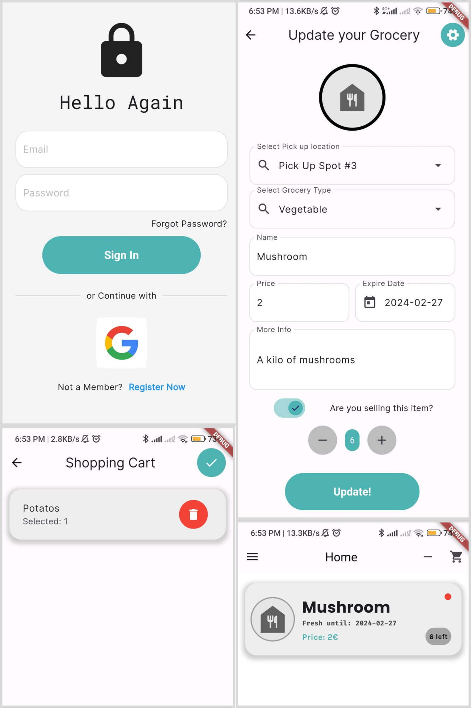
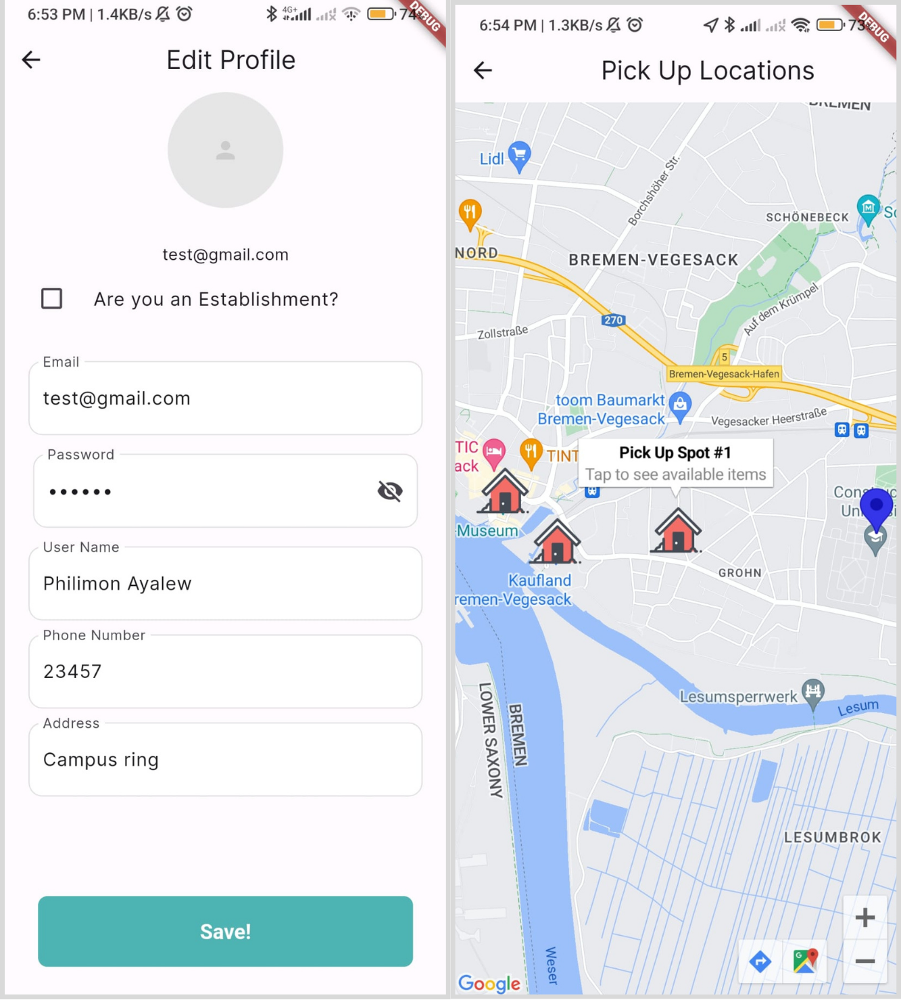

# Grub On 🥕

_A bite-sized solution to a global problem_

🎊 2024 Google Solutions Challenge Global Top 100 Finalist 🎊

Grub On tackles food waste and fosters community connections by allowing individuals and businesses to share or sell surplus food. Users can easily list and discover various food items, from groceries to home-cooked meals, through an interactive map. An AI-powered freshness checker helps users assess quality, while upcoming features like grocery tracking and recipe inspiration further minimize waste.

While the application is not released yet, users can build the application by typing:

```
flutter build apk
```

### Key Features:

- **share or Sell with Ease**: List surplus food items - groceries, restaurant leftovers, home-cooked meals, or fresh produce - in just a few taps. Choose to give them away for free or set a small price to offset your costs.

- **Find Food Gems Nearby**: Discover available food items around you with our interactive map.

- **Smart Freshness Check**: Concerned about an item's quality? Snap a picture using our AI-powered freshness checker. Get an instant analysis to help you decide and avoid food waste.

Coming Soon:

- **Advanced Filtering**: Filter by location, category (fruits, vegetables, packaged goods, etc.), and even preferred price range to find exactly what you're craving.

- **Grocery Tracker**: Never let food reach expiry again! Receive handy reminders for approaching expiration dates, prompting you to use or donate your groceries before they spoil.

- **Recipe Inspirations**: Leftover ingredients got you stumped? Upload a picture and our AI will suggest delicious recipes to whip up, minimizing food waste and unleashing your culinary creativity.

- **Community Chat**: Build trust and connect with fellow food savers through an integrated chat feature. Discuss item details, arrange pickups, or simply share your passion for sustainability.

- **Validated Pickups**: Opt for secure transactions with our planned validated pickup locations. We'll verify donations and ensure food safety for both givers and receivers. Plus, enjoy the convenience of optional delivery for a small fee.

# Tech Stack

- Frontend: Built with **Flutter**
- Backend: **Firebase** Authentication for user login and Firestore for data storage.
- Other Tools: **Google Maps** and **Tensorflow/lite** for on device food freshness check

- Dataset used: Sultana, Nusrat; Jahan, Musfika; Uddin, Mohammad Shorif (2022), “Fresh and Rotten Fruits Dataset for Machine-Based Evaluation of Fruit Quality”, Mendeley Data, V1, doi: 10.17632/bdd69gyhv8.1

# Installation

### Prerequisites

- Flutter SDK: https://flutter.dev/docs/get-started/install
- Android Studio or Visual Studio Code (with Flutter plugin) for development
- Clone the Repository

### Set Up Firebase

- Add firebase to your system using https://firebase.google.com/docs/flutter/setup?platform=android
- Create a Firebase project at https://console.firebase.google.com/
- Enable the following Firebase services: Authentication and Firestore.

### Install Dependencies

- run

```
cd ./grubOn/
flutter pub get
```

### Configure Google Maps

- Follow the instructions at https://mapsplatform.google.com/ to obtain a Google Maps API key.
- Specify your API key in the application through an env file named GOOGLE_API_KEY

### Running the Project

- Connect your Android device or iOS simulator to your development environment.
- Run the following command in your terminal:

```
flutter run
```

# Demo and Screenshots




# Authors

Philimon Ayalew

- [@philimon-reset](https://github.com/philimon-reset)

Hizkyas Aberra

- [@Doro-000](https://github.com/Doro-000)

Salem Bisenebit

- [@salemylkl](https://github.com/salemylkl)

Grub On was crafted with a whole lot of 🍕 and a sprinkle of 🫰🏾 from our team in Bremen.

Google Developer Student Clubs Constructor University.
